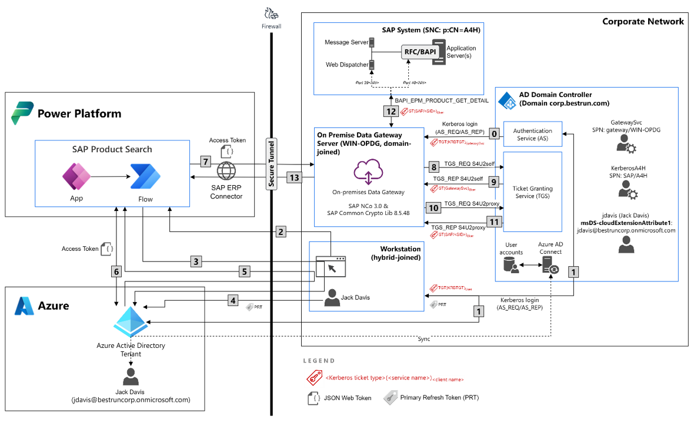

This repository contains the sample code of part VI from the blog series for the principal propagation between Microsoft Azure and SAP Cloud Platform. More information about the scenario and a detailled setup guide can be found [in this blog post](https://blogs.sap.com/2022/11/02/principal-propagation-in-a-multi-cloud-solution-between-microsoft-azure-and-sap-business-technology-platform-btp-part-vi-calling-the-microsoft-graph-on-behalf-of-the-sap-authenticated-user/).
